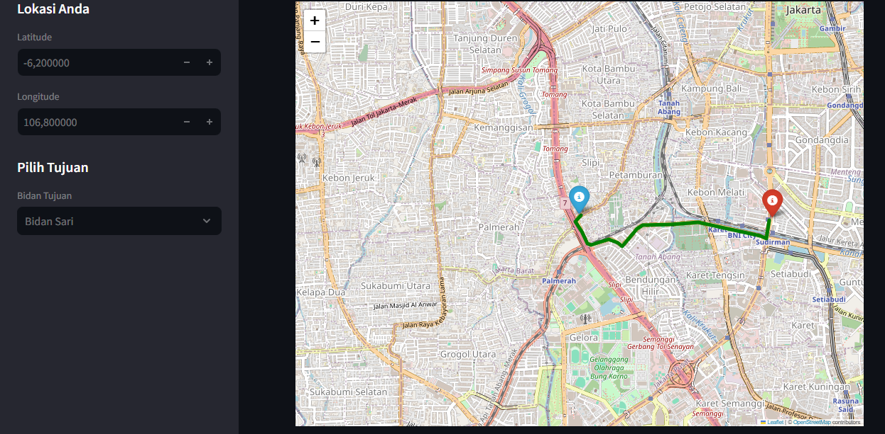

# 🗺️ Rute Bidan Jakarta

Aplikasi berbasis **Streamlit** untuk menampilkan rute terdekat menuju bidan di Jakarta menggunakan data jaringan jalan dalam format **GeoJSON**.  
Aplikasi ini meniru fungsi sederhana seperti **Google Maps**, tapi fokus pada layanan bidan dengan rute terdekat.

---

## 🚀 Fitur
- Input lokasi pengguna (manual latitude/longitude, bisa dikembangkan dengan geolokasi browser).  
- Pilih tujuan **bidan** dari CSV (`bidan_points.csv`).  
- Hitung rute terdekat menggunakan **algoritma Dijkstra**.  
- Visualisasi peta interaktif dengan **Folium**:
  - Marker posisi pengguna (biru).
  - Marker bidan tujuan (merah).
  - Garis rute (hijau).
- Optimasi performa:
  - **Filter data** hanya wilayah Jakarta dari GeoJSON besar.
  - **`st.session_state`** untuk caching graph, data bidan, dan rute agar tidak terus-ter-refresh.

---

## 📸 Screenshot
Contoh tampilan aplikasi di browser:

> Letakkan screenshot aplikasi kamu di folder `images/` dengan nama `screenshot.png`.

---

## 📂 Struktur Folder

Rute-Terdekat-Bidan/
    app.py
    bidan_points.csv
    Jaringan_jalanan_indonesia.geojson   # Tidak disimpan di GitHub (>100 MB)
    requirements.txt
    README.md
    images/
        screenshot.png

---
## 📊 Data Jaringan Jalan (GeoJSON)

File **`Jaringan_jalanan_indonesia.geojson`** tidak disertakan dalam repo karena ukurannya melebihi batas GitHub (>100 MB).  

➡️ Kamu bisa **mengunduh data shapefile jaringan jalan (SHP)** dari situs berikut:  
👉 [Download Shapefile Jaringan Jalan Indonesia](https://www.indonesia-geospasial.com/2024/12/download-shapefile-jaringan-jalan.html)  

Setelah diunduh, kamu bisa mengonversi SHP menjadi GeoJSON dengan tools seperti:  
- [QGIS](https://qgis.org/)  
- [GDAL/ogr2ogr](https://gdal.org/programs/ogr2ogr.html)  
- Python `geopandas`  

---

## 1️⃣ Clone Repository
git clone https://github.com/username/Rute-Terdekat-Bidan.git
cd Rute-Terdekat-Bidan

## 2️⃣ Buat Virtual Environment (Opsional tapi direkomendasikan)
## Linux / MacOS
python3 -m venv venv
source venv/bin/activate

## Windows
python -m venv venv
venv\Scripts\activate

## 3️⃣ Install Dependency
pip install -r requirements.txt

## 4️⃣ Siapkan Data
 - bidan_points.csv sudah ada di folder repo
 - Jaringan_jalanan_indonesia.geojson:
##   Unduh SHP dari: 
 - https://www.indonesia-geospasial.com/2024/12/download-shapefile-jaringan-jalan.html
 - Kemudian konversi ke GeoJSON menggunakan QGIS / GDAL / geopandas
 -  Simpan hasilnya di folder repo dengan nama:
 -   Jaringan_jalanan_indonesia.geojson

## 5️⃣ Jalankan Aplikasi
streamlit run app.py

### Browser akan terbuka otomatis di http://localhost:8501
###  Masukkan latitude/longitude dan pilih bidan tujuan untuk melihat rute

---

## 🔧 Teknologi yang Digunakan
- [Streamlit](https://streamlit.io/)  
- [Pandas](https://pandas.pydata.org/)  
- [Folium](https://python-visualization.github.io/folium/)  
- [GeoJSON](https://geojson.org/)  
- Algoritma **Dijkstra** untuk rute terdekat  

---
